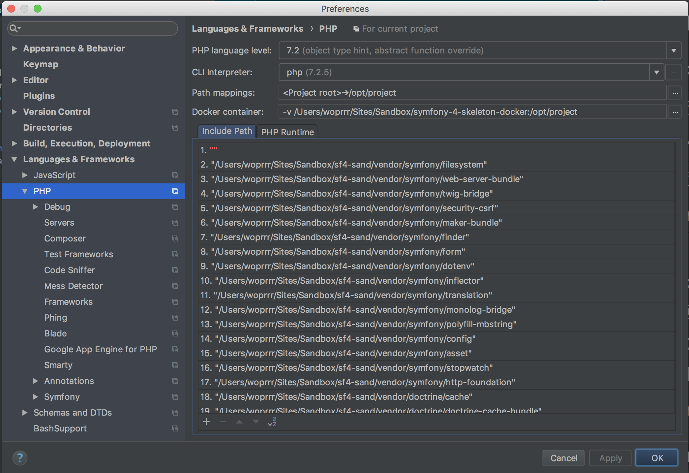
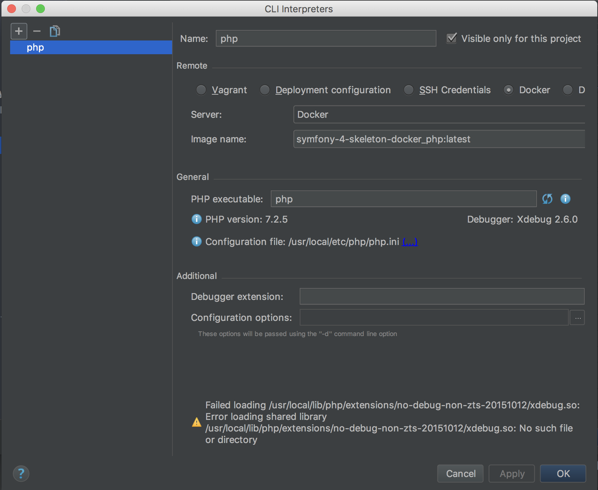
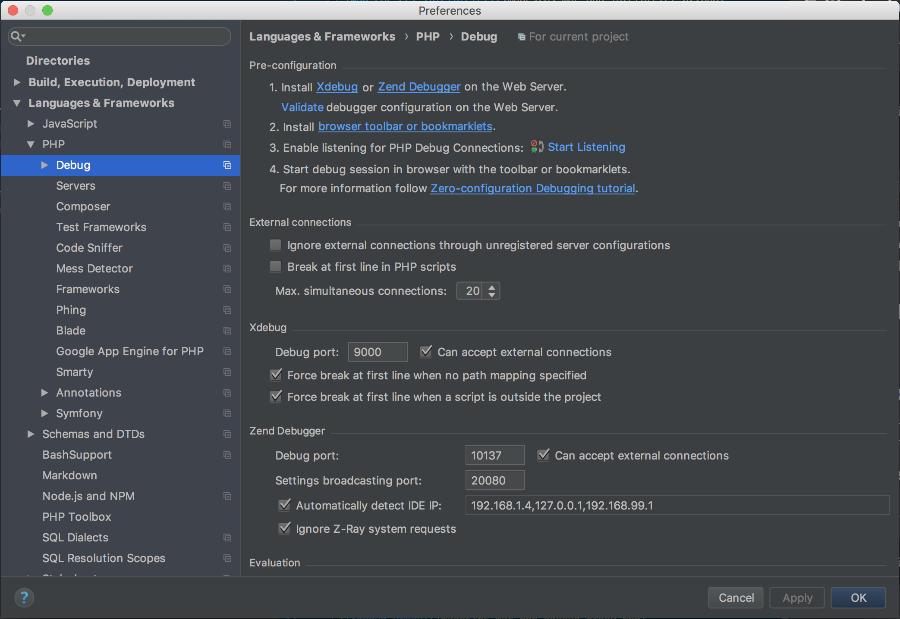
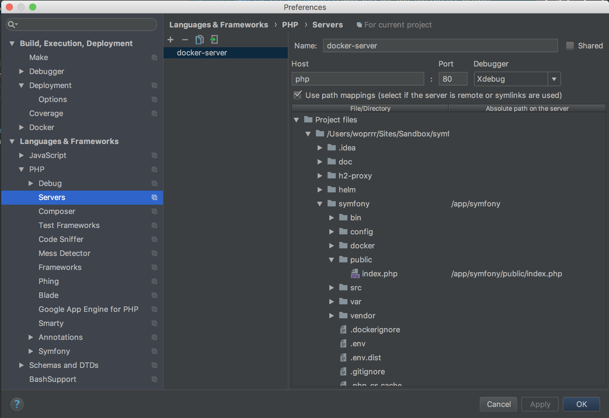

# Configure PHPStorm for MacOS

## Edit PHP configuration



## Add a PHP interpreter



## Configure XDebug

### Edit `docker-compose.yml` file

Edit the following part :

```yml
    php:
        environment:
            XDEBUG_CONFIG: "remote_host=docker.for.mac.localhost idekey=IDE_XDEBUG"
            PHP_IDE_CONFIG: "serverName=docker-server"
```

1. Adjust `XDEBUG_CONFIG` if you're using Linux (remote_host=docker.for.win.localhost) or Windows (remote_host=172.17.0.1).
2. Edit `PHP_IDE_CONFIG` or Add a serverName named `docker-server` and set absolute path /app/symfony for ./symfony folder @see [How to add debug server](#xdebug-server)

### Check Debug section



### Add a debug server


